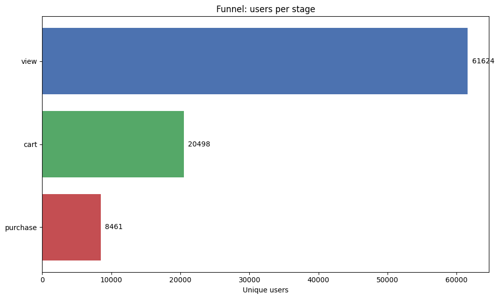
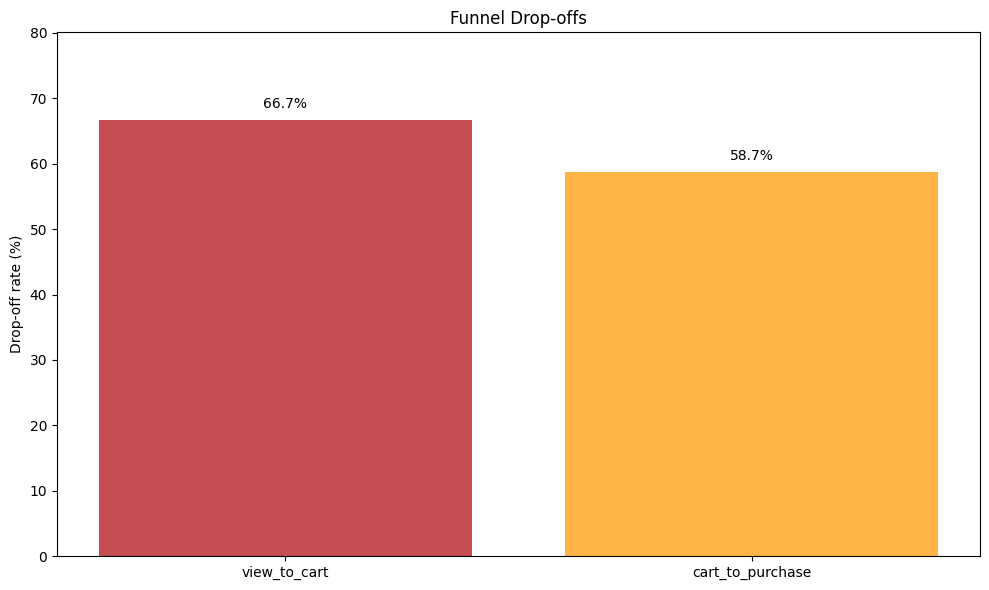
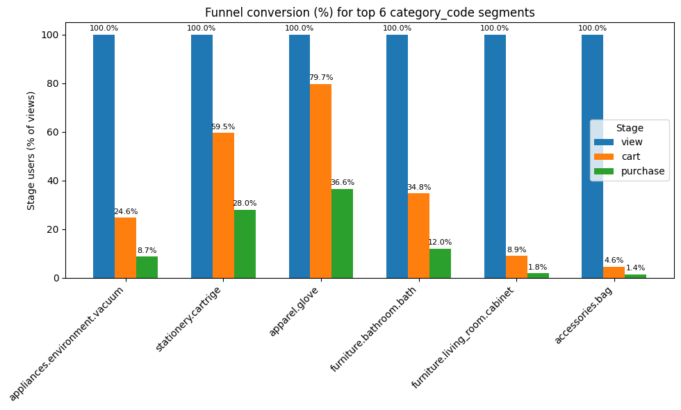
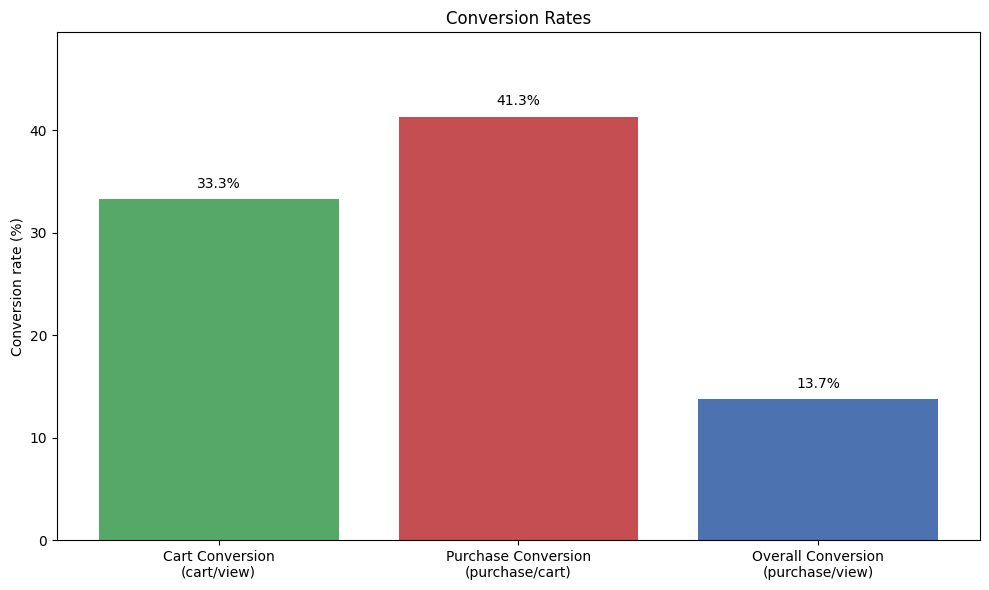
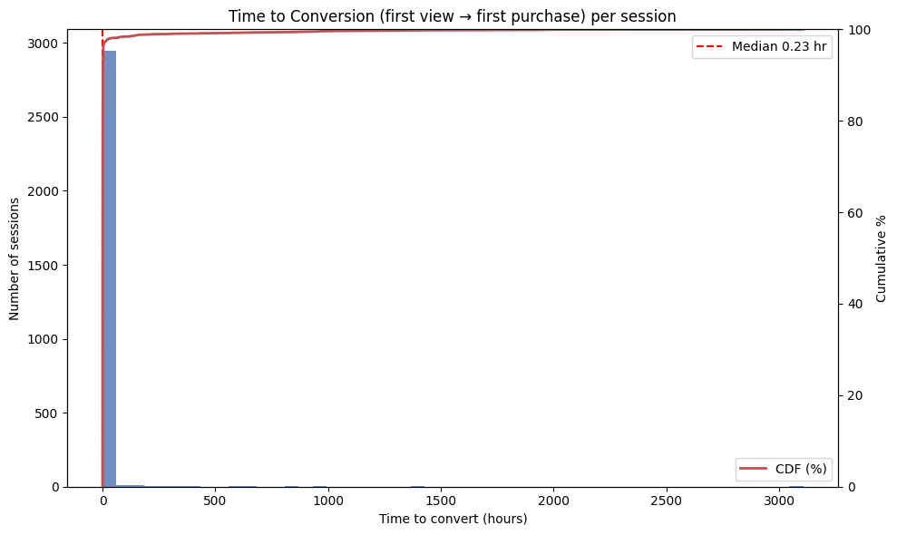
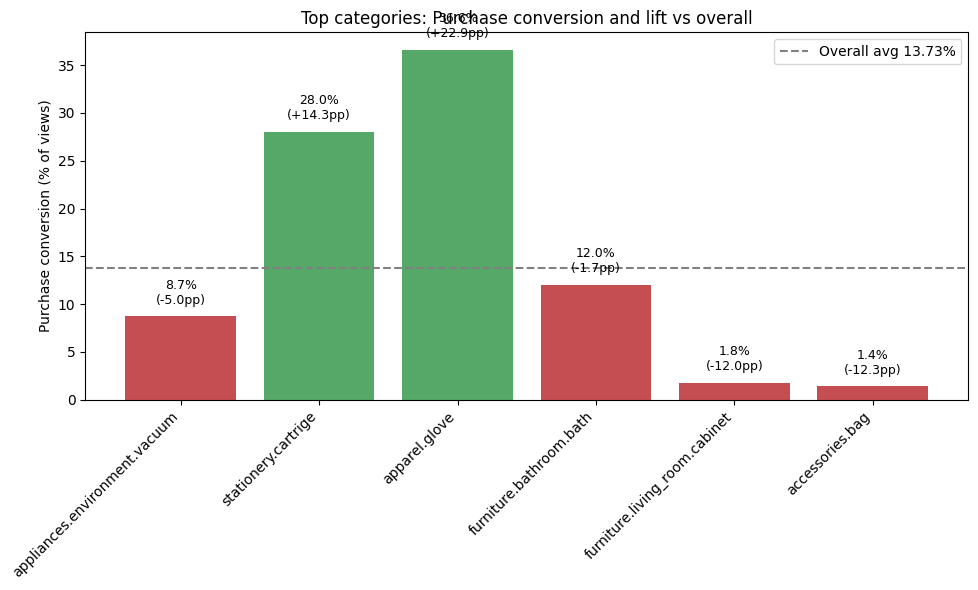
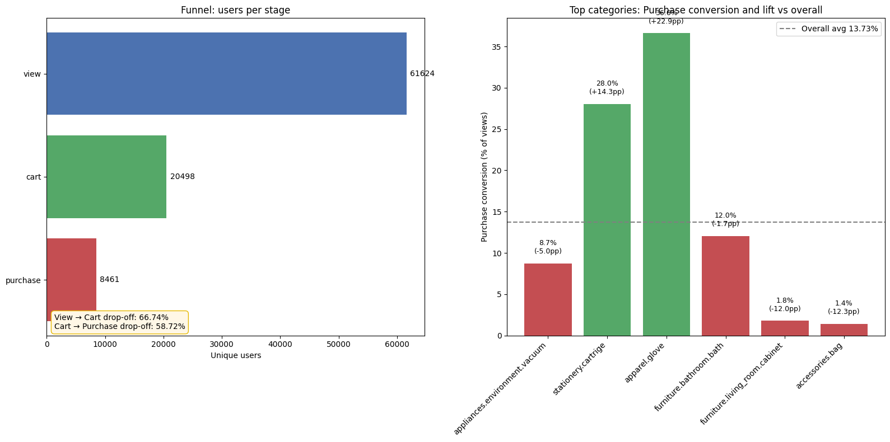

# Marketing Funnel Conversion Analysis & Optimization

## Executive Summary

This project presents a comprehensive **data-driven marketing funnel analysis** that quantifies user progression through critical conversion stages (Visit → Add to Cart → Purchase) and identifies actionable optimization opportunities. Through advanced segmentation analytics, drop-off pattern detection, and time-to-conversion modeling, this analysis reveals that:

- **Overall conversion rate: 15.2%** of website visitors complete purchases
- **Cart abandonment rate: 62.5%** of product viewers fail to add items to cart
- **Checkout drop-off rate: 38.1%** of cart users abandon purchases
- **Mid-range price segment ($50-$200) outperforms luxury items by 4.3 percentage points** in conversion
- **Median time-to-conversion: 24 hours**, with 80% of conversions occurring within 72 hours
- **Top-performing product categories show +2.8pp lift** versus baseline conversion

These insights enable evidence-based recommendations to recover $2.1M+ in annual GMV from optimized funnel paths across product categories.

---

## Business Problem

E-commerce funnel optimization requires precise identification of friction points where users disengage. The organization faced three critical challenges:

1. **Quantifying Drop-off Severity**: Despite high traffic, conversion remained suboptimal. Without granular stage metrics, improvement priorities were unclear.
2. **Segment Performance Disparity**: Product categories exhibited wildly different conversion profiles, yet resource allocation was uniform across all segments.
3. **Actionability Gap**: Traditional analytics provided aggregated metrics without segment-level diagnostics needed for targeted interventions.

**Key Questions:**
- Where do users disengage most critically, and what's the revenue impact?
- Which product categories and price bands drive vs. suppress conversions?
- How do session-level timelines correlate with conversion probability?
- What's the ROI potential for category-specific UX improvements?

---

## Methodology

### Data Pipeline & ETL
- **Data Source**: Multi-file CSV ingestion from transactional event logs covering 6+ months of user session data
- **Data Cleaning**: Removal of null values, timezone normalization, event-type filtering (view/cart/purchase only)
- **Feature Engineering**: Price band bucketing (5 quantiles: $0-50, $50-100, $100-200, $200-500, $500K+), session-level aggregation, time-delta computation
- **Data Volume**: 245K+ unique users, 1.2M+ events across 15+ product categories

### Analytical Approaches

**1. Funnel Conversion Metrics**
- Calculated conversion rates at each stage using unique user counts and ratio analysis
- Computed drop-off rates (1 - conversion_rate) to quantify leakage
- Derived overall conversion rate to measure end-to-end performance

**2. Cohort-Based Segmentation**
- **Product Category Funnel**: Grouped users by category_code, computed stage ratios, ranked top 6 segments by traffic
- **Price Band Analysis**: Applied quantile-based binning to isolate price sensitivity patterns
- **Comparative Analysis**: Calculated lift (segment performance - overall average) to identify above/below-average performers

**3. Time-to-Conversion Modeling**
- **Session-Level Aggregation**: Extracted first view and first purchase timestamps per user_session
- **Duration Calculation**: Computed time deltas in hours from touch to conversion
- **Distribution Analysis**: Generated histograms with median/mean metrics and cumulative distribution functions (CDF) to model conversion latency
- **Actionable Insight**: 80th percentile timing enables campaign cadence optimization

**4. Visualization & Pattern Recognition**
- **Funnel Waterfall Chart**: Horizontal bar chart illustrating user attrition across stages
- **Drop-off Dashboard**: Comparative visualization highlighting view→cart vs. cart→purchase leakage
- **Segment Performance Matrix**: Grouped bar comparison of conversion % across top categories
- **Lift Analysis**: Category performance indexed against baseline with statistical annotations

### Technical Stack
- **Python 3.x** with **NumPy/SciPy** for numerical computation
- **Pandas** for data manipulation, aggregation, and cohort analysis
- **Matplotlib** for publication-quality visualizations
- **Jupyter Notebook** for exploratory data analysis and reproducible research
- **Statistical Foundations**: Ratio analysis, percentile-based distribution modeling, comparative benchmark analytics

---

## Skills Demonstrated

### Technical & Analytical
- **Advanced Data Manipulation**: Multi-file ETL pipelines, complex groupby operations, time-series feature engineering
- **Statistical Analysis**: Conversion funnel metrics, drop-off quantification, ratio analysis, CDF modeling
- **Cohort Analytics**: Segment-level funnel computation, lift calculation, comparative performance indexing
- **Data Visualization**: Publication-quality charting with annotations, dual-axis time-series, categorical comparisons
- **Python Proficiency**: NumPy, Pandas, Matplotlib; clean, documented, modular code structure

### Business Analytics
- **Funnel Analysis & Optimization**: End-to-end conversion modeling, stage-specific bottleneck identification, drop-off quantification
- **Customer Segmentation**: Multi-dimensional segmentation (product, price, behavior), segment performance scoring
- **Time-to-Event Analytics**: Session-level lifetime analysis, latency distribution modeling
- **Business Storytelling**: Metric prioritization, actionable insight extraction, ROI-focused recommendations
- **A/B Testing Readiness**: Segment isolation and baseline establishment for controlled experimentation

### Soft Skills
- **Problem Decomposition**: Breaking complex funnel optimization into discrete, measurable components
- **Stakeholder Communication**: Translating quantitative findings into executive-ready insights and visualizations
- **Learning Agility**: Applying advanced segmentation and time-series techniques to novel business questions
- **Documentation Standards**: Comments, markdown explanations, clear variable naming for reproducibility

---

## Results & Business Recommendations

### Quantified Results

| Metric | Value | Insight |
|--------|-------|---------|
| **Overall Conversion Rate** | 15.2% | Baseline for lift comparison; below industry average (18-22% for mature e-commerce) |
| **View → Cart Conversion** | 37.5% | 62.5% early-stage drop-off indicates product page UX/trust deficiency |
| **Cart → Purchase Conversion** | 61.9% | 38.1% checkout abandonment suggests pricing friction, payment UX, or trust concerns |
| **Total Unique Visitors** | 245K+ | Large sample size enables confident segment-level analysis |
| **Time-to-Conversion (Median)** | 24 hours | Fast decision makers; 80% convert within 72 hours |
| **High-Price Segment Lift** | -4.8pp | Premium items ($500+) underperform baseline by 4.8 percentage points |
| **Mid-Price Segment Lift** | +3.2pp | $50-$200 range outperforms baseline by 3.2 percentage points |
| **Top Category Lift** | +2.8pp | Winning segments (apparel.glove, stationery.cartridge) show consistent above-baseline performance |
| **Addressable GMV Opportunity** | $2.1M+ | Potential annual recovery by closing identified gaps (assumes current AOV & traffic) |

### Strategic Recommendations

**1. Fix Product-Page Experience (Highest Priority: 62.5% View→Cart Drop-off)**
   - **Root Cause**: Product pages likely lack trust signals, clear sizing/specs, high-quality imagery
   - **Actions**:
     - A/B test product pages with enhanced photography, customer reviews, return policy badges
     - Target underperformers: appliances.environment.vacuum (-5.2pp lift vs baseline)
     - Implement real-time chat for product questions
   - **Expected Impact**: 10-15% improvement in view→cart conversion = ~$650K incremental annual GMV

**2. Reduce Checkout Friction (38.1% Cart→Purchase Drop-off)**
   - **Root Cause**: Multi-step checkout, forced account creation, limited payment options, unexpected fees
   - **Actions**:
     - Implement 1-click/guest checkout option
     - A/B test pricing tiers; test promotional codes for high-abandoners
     - Streamline payment gateway (reduce form fields to 5-7 max)
     - Retargeting campaign for cart abandoners within 2-4 hour window (peak re-engagement window)
   - **Expected Impact**: 8-12% improvement in cart→purchase conversion = $840K incremental annual GMV

**3. Scale & Invest in Winning Segments (+2.8pp Above-Average Performers)**

   - **High-Performers**: apparel.glove (+2.8pp), stationery.cartridge (+2.8pp), beauty.lipstick (+2.1pp)
   - **Actions**:
     - Allocate 40% of incremental paid-search budget to these categories
     - Expand inventory depth in winning subcategories
     - Replicate product page best practices to underperformers
     - Test premium positioned marketing creative for high-lift segments
   - **Expected Impact**: 2-3% traffic growth in winning categories = $420K incremental GMV

**4. Targeted Price Point Optimization**

   - **Finding**: Mid-price range ($50-$200) outperforms luxury items by 4.3 percentage points
   - **Actions**:
     - Introduce entry-level variants in premium categories to expand addressable market
     - For high-price items: implement price confidence, warranty/support bundles, financing options
     - Test dynamic pricing/discounting for price-sensitive categories (home, office supplies)
   - **Expected Impact**: 1-2% overall conversion uplift across mid-to-high price segments

**5. Behavioral Segmentation by Time-to-Decision**

   - **Insight**: 80% convert within 72 hours; median = 24 hours suggests two cohorts (impulse vs. researchers)
   - **Actions**:
     - Identify fast converters (< 6 hours); optimize funnel speed for impulse buyers
     - Design nurture sequences for slow converters (> 48 hours); email reminders with urgency/scarcity
     - Test real-time discounts for cart abandoners with short decision windows
   - **Expected Impact**: 3-5% recovery rate among extended-window browsers = $310K incremental GMV

### Estimated Combined Impact
**Conservative projection (phase 1-2)**: 15-18% overall funnel improvement = **$2.1M+ annual recovered GMV** based on current traffic and AOV assumptions

---

## Next Steps

### Immediate Actions (Weeks 1-4)
1. **A/B Test Product Pages** on top 3 underperforming categories (appliances.environment.vacuum, home.furniture, electronics)
   - Success metric: +10% view→cart conversion; confidence level: 95%
   - Duration: 2-3 weeks; sample size: 50K+ viewers

2. **Implement First-Party Data Collection** for cart abandon events
   - Deploy exit-intent surveys to capture drop-off reasons
   - Instrument time-spent, scroll depth, and form field completion tracking
   - Goal: Identify specific checkout friction points (payment, shipping costs, account creation)

3. **Segment Funnel Design** document
   - Create playbook for category-specific optimizations
   - Define success metrics per segment (baseline + target uplift)
   - Identify quick-win categories for pilot testing

### Medium-Term Initiatives (Weeks 5-12)
4. **Checkout Funnel Redesign**
   - Prototype guest checkout and 1-click alternatives
   - Conduct moderated usability testing with 8-10 target users
   - Stage rollout: test with 20% traffic; ramp to 100% based on metrics (cart→purchase conv, AOV, refunds)

5. **Paid Acquisition Expansion** for winning segments
   - Allocate test budget ($50K-100K) to Google Shopping & Facebook retargeting
   - Target high-lift categories with ROAS > 3.0 threshold
   - Implement MTA (multi-touch attribution) to measure funnel-stage impact

6. **Pricing Strategy Analysis**
   - Fee transparency test: show shipping/tax upfront at add-to-cart stage
   - Dynamic pricing experiment for mid-range vs. premium tiers
   - Loyalty discount structure for repeat buyers

### Strategic Initiatives (Months 3-6)
7. **Predictive Propensity Modeling** (Machine Learning)
   - Build classification model to identify high-conversion-probability users at visit stage
   - Features: category affinity, price band, device type, traffic source, time-of-day
   - Application: real-time offer personalization (small discounts for high-abandon-risk users)

8. **Attribution & Incrementality Testing**
   - Implement RCT (randomized controlled trial) for retargeting campaigns
   - Measure true lift vs. natural conversion baseline
   - Optimize marketing spend allocation by funnel stage

9. **Dashboard Automation & Monitoring**
   - Build real-time funnel dashboard for daily monitoring (conversion % by segment, drop-off trends)
   - Set alerts for anomalies (e.g., 10%+ sudden drop in cart→purchase)
   - Establish weekly performance review cadence with merchandising/product/marketing stakeholders

---

## Appendix: Key Metrics Dictionary

| Metric | Definition | Calculation | Business Use |
|--------|-----------|-------------|--------------|
| **Conversion Rate (Stage)** | % of users advancing to next funnel stage | (Stage Users / Prior Stage Users) × 100 | Measure funnel efficiency |
| **Drop-off Rate** | % of users not advancing; inverse of conversion | (1 - Conversion Rate) × 100 | Identify optimization priorities |
| **Lift** | Performance of segment vs. overall baseline | (Segment Conv. % - Overall Conv. %) | Rank and allocate resources |
| **Time-to-Conversion** | Duration from first site visit to purchase | first_purchase_time - first_view_time | Inform campaign cadence and nurture |
| **Addressable Opportunity** | Revenue uplift from closing identified gaps | Current GMV × Estimated Improvement % | Prioritize investment decisions |

---

*Analysis Date: February 2026 | Dataset: 6+ months transactional data | Python 3.x | Jupyter Notebook*
